# Radio World

# Integration Guide: Radio World

## Table of Contents

1. [Introduction]
2. [Prerequisites]
3. [Setup Instructions]
    1. [Step 1: Setup the environment]
    2. [Step 2: Configure the Integration]
    3. [Step 3: Test the Integration]
4. [Features]
5. [Enhancements]
6. [Demo]
7. [Authentication]
8. [API Reference]
9. [Common Errors & Troubleshooting]
10. [FAQs]
11. [Support]

---

## Introduction

This guide provides step-by-step instructions for integrating [Radio World] into your project.
Follow the instructions to quickly get started and connect your system with [Radio World].

---

## Prerequisites

Before you begin the integration process, make sure you have the following:

- A ApiKey service from Radio World
- Access to your [system’s] configuration settings

## Setup Instructions

    - Xcode Version 16.1 (16B40)

### Step 1: Install Dependencies

Start by installing the required dependencies to your project.
    - pod init
    - pod install

### Step 2: Configure the Integration
    you might need to update the base url if the server below get down
    static let baseUrl = "https://de1.api.radio-browser.info/"

### Step 3: Test the Integration

   Just run Run the application on your device (you might need to setup apple account).

## Features

    01-Splash screen
    02-Station List
    03-My favorite
    04-Settings (languages and theme mode)
    05-Play the station in both foreground and background
    06-Comprehensive filtration for the stations (genre, tag, language and country)

## Demo

### Screenshots

- **Dashboard View**

| 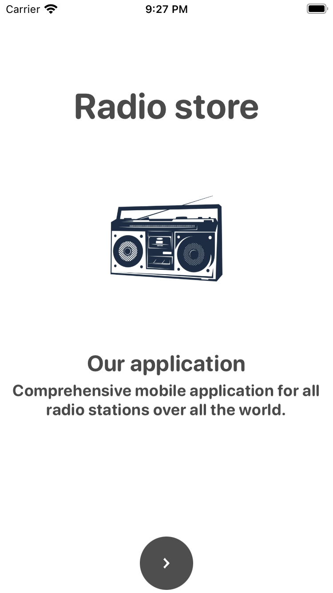 | 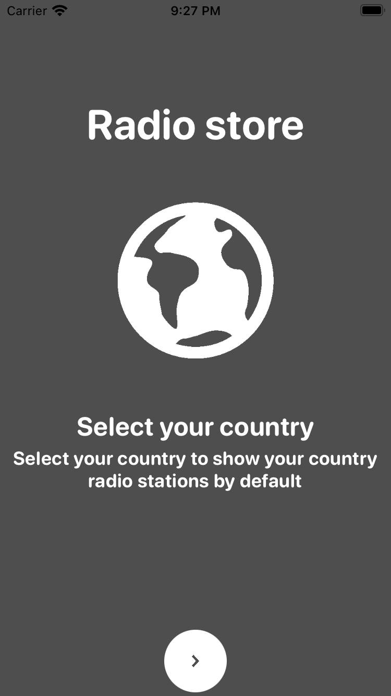 | 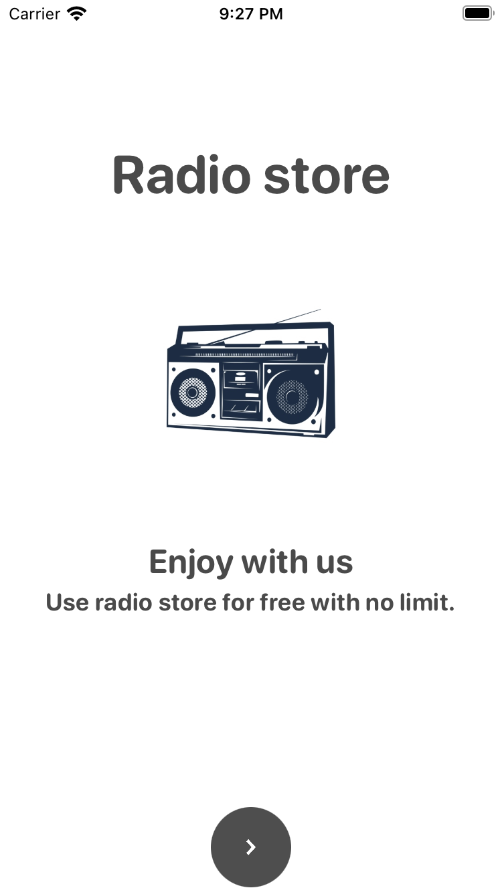 | 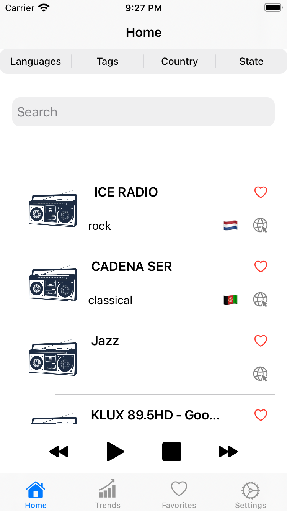 |
|-----------------|-----------------|-----------------|-----------------|

|  | 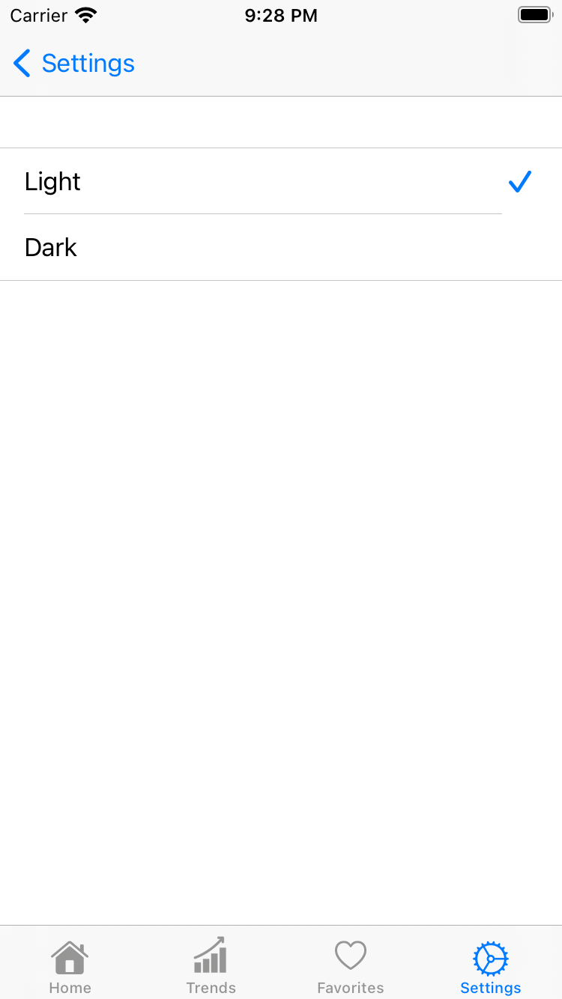 | 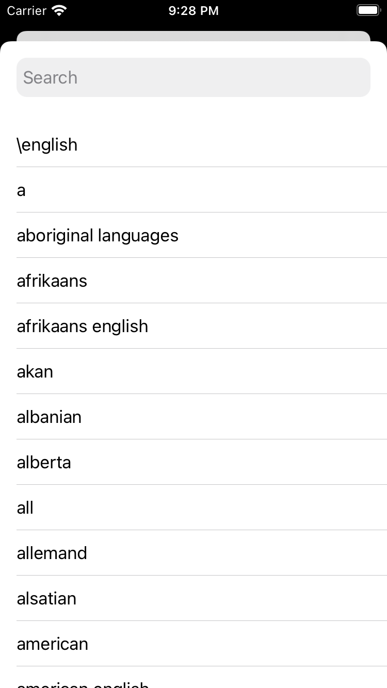 | 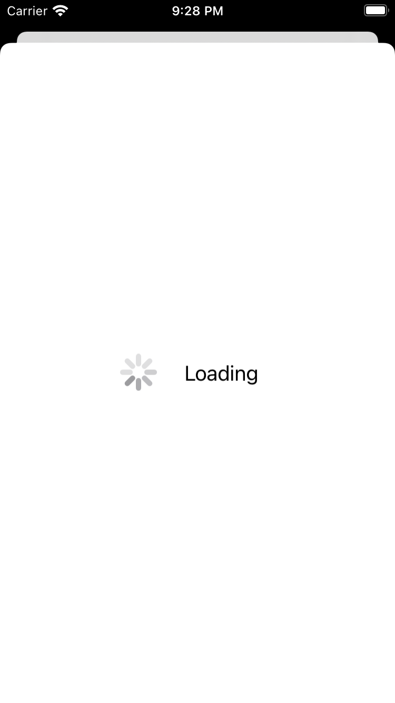 |
|-----------------|-----------------|-----------------|-----------------|

|  | 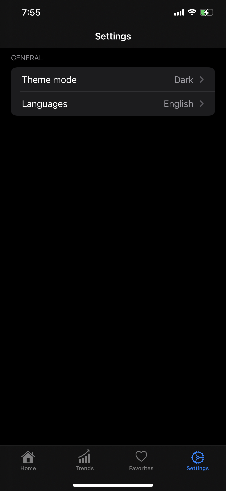 | 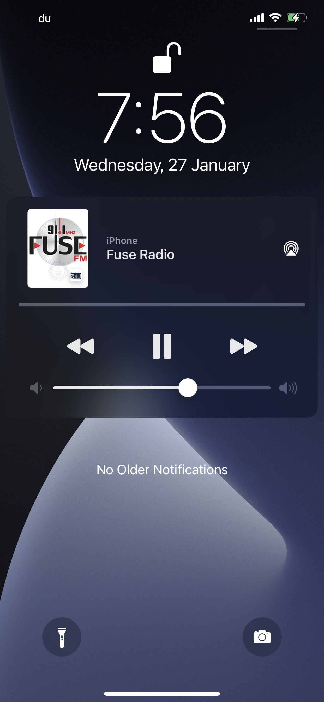 | 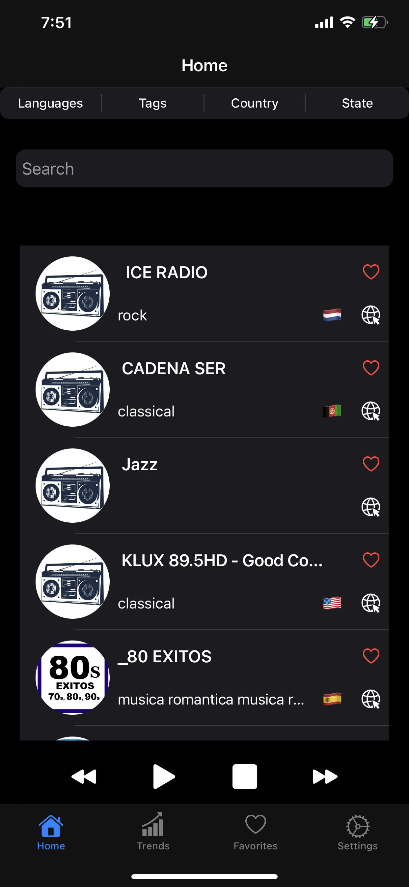 |
|-----------------|-----------------|-----------------|-----------------|

| 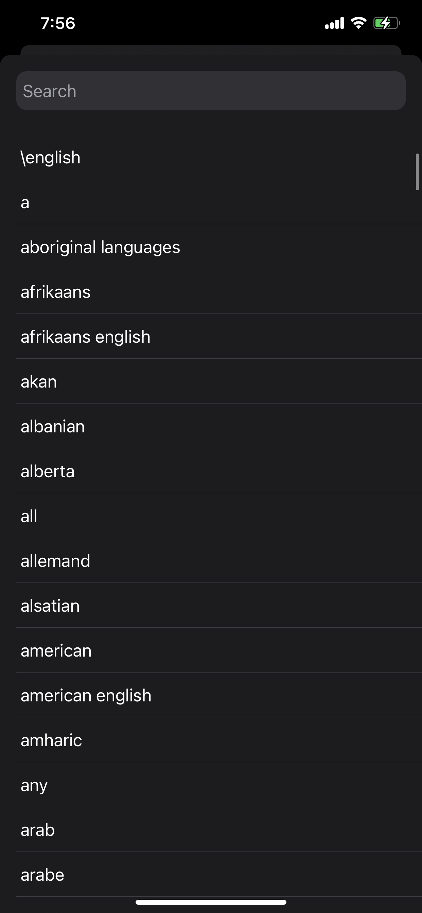 | 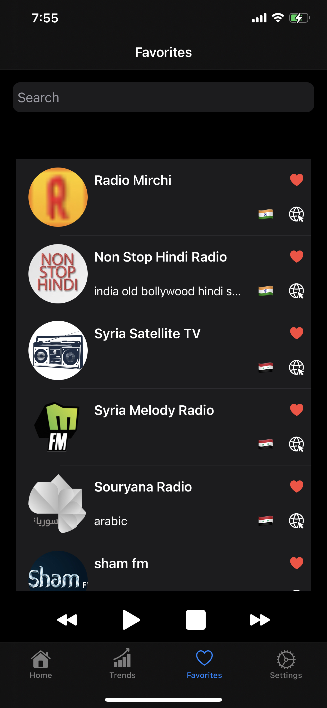 | 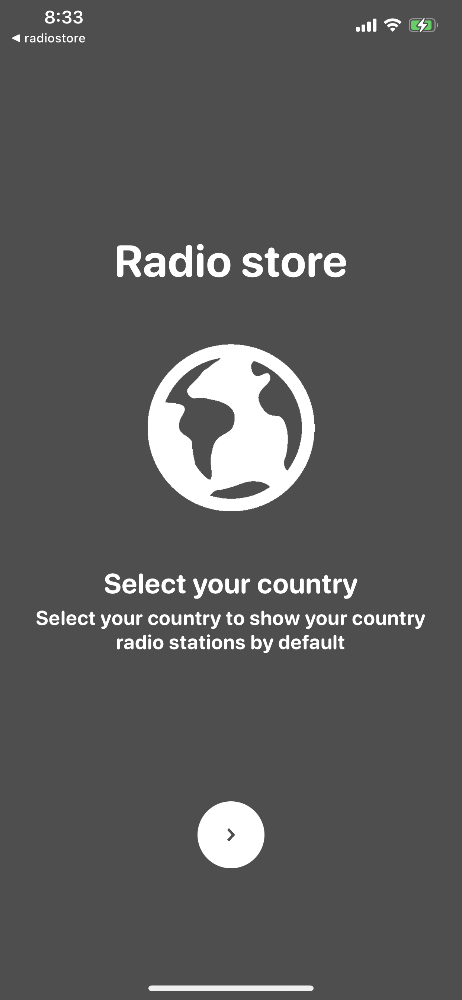 |  |
|-----------------|-----------------|-----------------|-----------------|

### Videos

| |
|-----------------|  

## Authorization

No authorization is required here

## Api reference

<https://api.radio-browser.info/>

## Common Errors & Troubleshooting

<https://github.com/adhamkhwaldeh/RadioWorldiOS/issues>

## FAQs

<https://github.com/adhamkhwaldeh/RadioWorldiOS/issues>

## Support

<https://github.com/adhamkhwaldeh/RadioWorldiOS>
